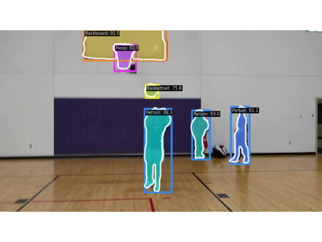
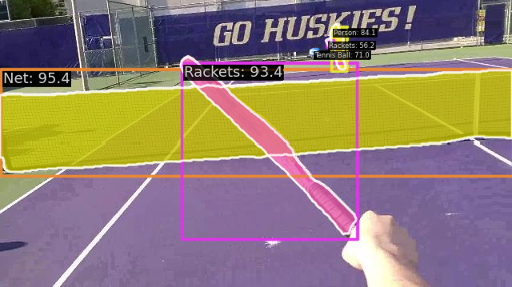
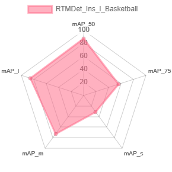
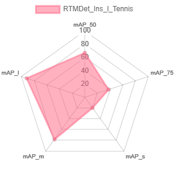

# ARSports

Welcome to Makeability Lab's repository of ARSports, a prototype augmented reality (AR) system for supporting low-vision sports featuring real-time object highlighting based on RTMDet_Ins model. 

## Performance

In this project, we present two RTMDet models fine-tuned specifically for instance segmentation tasks in real-time sports scenarios. Trained weights can be downloaded [here]().

Inference on images:

    
    

Inference on videos:

    
    

| Model     | loss_cls | loss_mask | loss_bbox | COCO/segm_mAP_50 | COCO/segm_mAP_75 | COCO/segm_mAP_s | COCO/segm_mAP_m | COCO/segm_mAP_l |
|:----------|:------------:|:----------:|:-------------------------:|:----------------------:|:-----------------------------------------------:|:--------------------------------------------------:|:----------:|:----------:|
| RTMDet-l-Basketball |   0.0964   |    0.1491     |             0.1933             |          0.876          |                      0.569                      |                       0.316                        |     0.733      |     0.866      |  

    
    

## Requirements
* Python 3.8 and above
* PyTorch with CUDA enabled
* CUDA 11.4 and above

## Dataset & Finetuning

In this repo, we also present the first dataset that features first-person point-of-view scenarios for basketball & tennis, collected and annotated by the project team. The basketball set contains 2,430 images and the tennis set has 2,982 images.

Objects annotated in basketball scenarios include:
1. Person
2. Basketball
3. Hoop
4. Backboard

Objects annotated in tennis scenarios include:
1. Person
2. Tennis Ball
3. Net
4. Racket

For a tutorial on fine-tuning the RTMDet model with customized datasets, please refer to [this repo](https://github.com/makeabilitylab/mmdet-fine-tuning).
